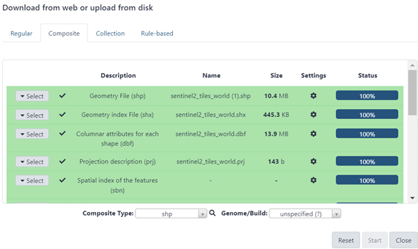
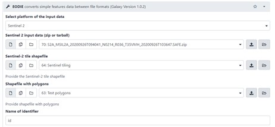
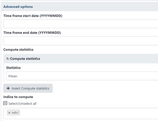
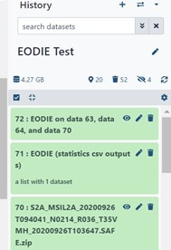
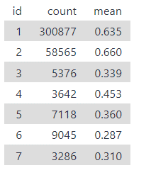

.. _galaxy:

EODIE Galaxy -tool tutorials  
=============================

The GUI version of EODIE can be found on the Galaxy Europe website 
(https://usegalaxy.eu/root?tool_id=toolshed.g2.bx.psu.edu/repos/climate/eodie/eodie/1.0.2). 
The Galaxy tool uses EODIE version 1. 
    
Sentinel-2 tutorial
====================
    
This is a tutorial on how to use EODIE Galaxy -tool with Sentinel-2 images.
---------------------------------------------------------------------------

| Inputs:

- Sentinel-2 data in tar or zip format
- Sentinel 2 tiling in shp format
- Vector polygons in shp format

| Output options

- Index statistics per polygon in csv format
- Index statistics in GeoTiff format

Workflow:

1. Choose “Upload data” on the left and upload required inputs (Fig. 1). Notice that a parent folder must be included in the .tar or .zip file. For shapefiles, use upload option “Composite” 
and upload the shapefile and all related auxiliary files (.shx, .dbf and .prj in this example).
Use option “Regular” for satellite data. 

2. Select platform, Sentinel-2 in this example, and input files under corresponding headers in the 
Tool-window (Fig. 2). “Name of Identifier” parameter refers to the name of the shapefile column 
that contains polygon ids.
    

    

3. Time frame, statistics and indices can be defined under the ‘Advanced options’ -section (Fig. 3). One or more indices and statistics can be chosen. Available output options include csv and geotiff. When all inputs are defined, click “Execute” at the bottom of the Tool-window.
    

            

The progress of the job can be followed in the History-panel (Fig. 4). 
Grey color means that the job is in queue, orange indicates that it is running, and green color 
means it has succeeded. Red color indicates that the job has failed. 

|pic4a| any text |pic4b|

We can see that the example job was successful, and a csv file was created. 
Mean is the average NDVI of polygon features and count is the number of valid pixels per polygon.
            
    
    
    
    
    
            
    
            
    

